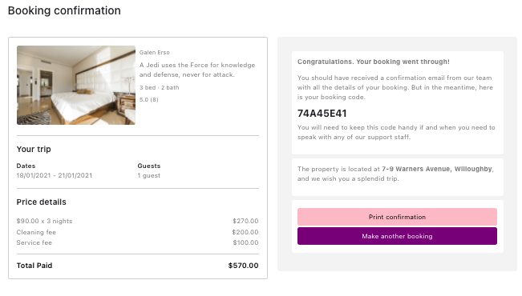

# AirCnB platform

This is a group project and an attempt to clone the popular AirBnB platform.

### Links
* Github Rails code: https://github.com/jkups/rails-aircnb
* Github React code: https://github.com/jkups/react-aircnb

* Live demo (Backend): https://aircnb.herokuapp.com
  - Test Credentials:
    * username - david@ga.co,
    * password - chicken

* Live demo (Frontend): https://jkups.github.io/react-aircnb
  - Test Credentials:
    * username - john@ga.co,
    * password - chicken

### Tech Stack
* React
* Ruby on Rails
* HTML / CSS / JavaScript

### APIs / Plugins
* Bootstrap
* Braintree
* Google Maps
* Chartjs
* Sendgrid

## How to use
Making a booking on AirCnB is quite straigthforward. Simply search for a property, select your booking dates and make payment online.

Here is a snapshot of the interface and possible workflow:

Homepage (search for an accomodation):

 

Your search result is displayed:

 

Select an accommodation and make your booking:

 

Secure your booking by paying online with credit or deit card:

 

You get your booking confirmation once your payment goes through. This confirmation will also be sent to your registered email:

 

### Known Issues and Bugs
* Filters on search result page displays inaccurate results sometimes
* Page navigation doesn't update as expected when filter is applied on the search results

### Future features
* Implement robust error handling
* Make the platform mobile ready
* Implement a host feature
